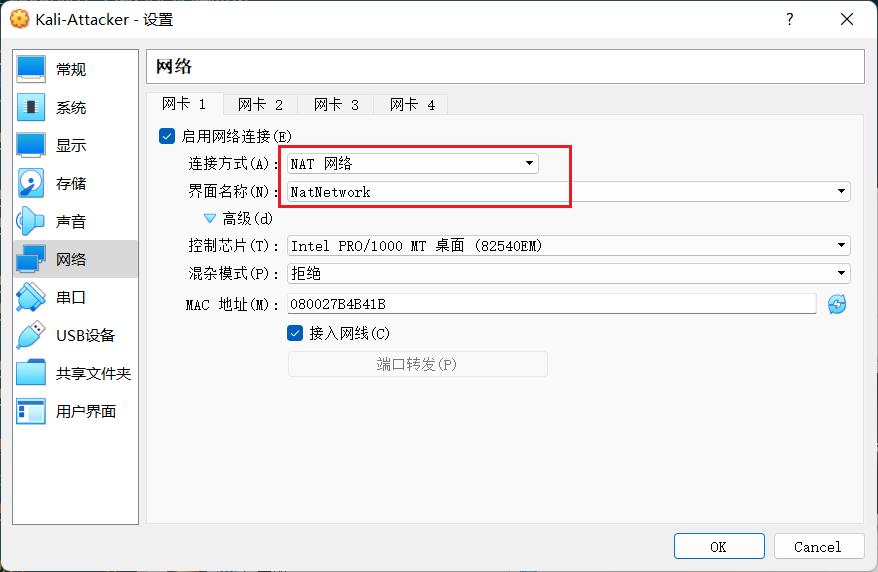

# chap0x01

------
auther:milkcandy

------

## 实验目的
* 掌握 VirtualBox 虚拟机的安装与使用；
* 掌握 VirtualBox 的虚拟网络类型和按需配置；
* 掌握 VirtualBox 的虚拟硬盘多重加载；

-----

## 实验环境

* VirtualBox 虚拟机
* 攻击者主机（Attacker）：kali-linux-2022.3-virtualbox-amd64
* 网关（Gateway, GW）：Debian Buster
* 靶机（Victim）：From Sqli to shell / xp-sp3 / Kali

-----

## 实验要求

* 虚拟硬盘配置成多重加载，配置完效果如下图所示；


</br>

* 搭建满足如下拓扑图所示的虚拟机网络拓扑；

</br>

* 配置网络前准备工作
`管理>主机网络管理器>创建新的hostonly地址>手动分配地址`
    * 作用：用于ssh登录虚拟机时更好地区分不同主机的网络地址。

</br>

* 搭建内部网络配置
`以Enterprise Network-2为例:`
    * 此局域网包括三台主机：Debian 10(gateway) | xp-victim-2 | debian-victim-2
    * 先配置`Debian 10(gateway)`的网络
    
    * 配置`xp-victim-2`的网络
    
    
    * 配置`debian-victim-2`的网络
    
    
    
    * 配置好网络后，可以发现虚拟机自动分配好了内网地址，如下图所示：
`Debian 10(gateway):`

`xp-victim-2：`

`debian-victim-2：`

* 测试内网连通性：
    先关闭`xp-victim-2`的防火墙：
    
    * `Debian 10(gateway)`和`xp-victim-2`之间的连通性：
    
    
    * `Debian 10(gateway)`和`debian-victim-2`之间的连通性：
    
    
    * `debian-victim-2`和`xp-victim-2`之间的连通性：
    
    
    

* 全局网络配置
    * 设置全局Nat network
    
    * 给debian(gateway)添加Nat
    
    * 给Kali-Attacker添加Nat
    

* 网络连接测试

    * 靶机可以直接访问攻击者主机
    
    
    * 攻击者主机无法直接访问靶机
    
   
    * 网关可以直接访问攻击者主机和靶机
    
    
    * 靶机的所有对外上下行流量必须经过网关
    在Debian10(GateWay)上安装tshark
    ```bash
    apt install tshark
    ```
    * 查看Debian10(GateWay)可检测接口：
    
    ```bash
    tshark -i enp0s9
    #监控intnet1的所有流量
    tshark -i enp0s10
    #监控intnet2的所有流量
    ```
    
    
    * 所有节点均可以访问互联网
    经测试，所以节点均可ping通www.baidu.com，即所有节点均可访问互联网。
## 出现的问题
* PS：ssh连接虚拟机设置

问题分析：可能是没开通ssh服务
```bash
apt update
apt install ssh
systemctl restart ssh
ssh root@192.168.56.113
#经过上述操作，发现可以成功连接ssh
```

## 参考资料
[VirtualBox 多重加载](https://expoli.tech/articles/2021/06/07/1623066136894.html)

</br>

[VirtualBox 配置网络](https://www-nakivo-com.translate.goog/blog/virtualbox-network-setting-guide/?_x_tr_sl=en&_x_tr_tl=zh-CN&_x_tr_hl=zh-CN&_x_tr_pto=sc)

</br>

[tshark 使用语法](https://www.wireshark.org/docs/man-pages/tshark.html)