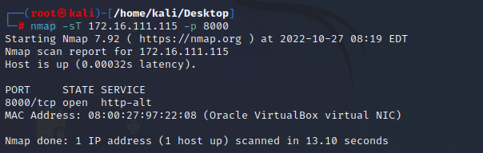
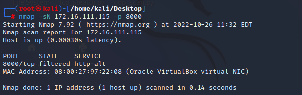
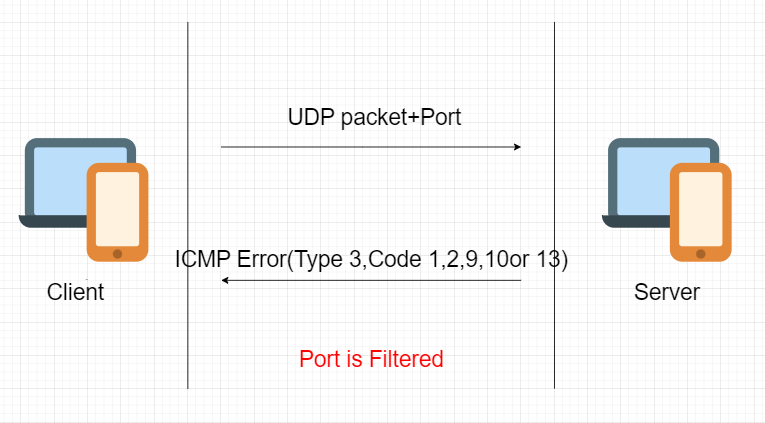
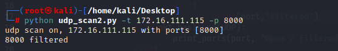

# chap0x05 基于Scapy编写端口扫描器
## 实验目的
* 掌握网络扫描之端口状态探测的基本原理 
## 实验环境
* 虚拟机：
    * debian-gw 
        * enpos9/172.16.111.1
        * 08:00:27:e8:c0:ff
    * Kali-Attacker-1
        * eth0/172.16.111.110
        * 08:00:27:0f:4c:77
    * Kali-victim-1
        * eth0/172.16.111.102
        * 08:00:27:74:ac:67
* 宿主机：win11
* 编程环境：python + scapy
* 实验拓扑：  
  

## 实验要求
- [x] 禁止探测互联网上的 IP ，严格遵守网络安全相关法律法规。
- [x] 完成以下扫描技术的编程实现
    * TCP connect scan / TCP stealth scan
    * TCP Xmas scan / TCP fin scan / TCP null scan
    * UDP scan
- [x] 上述每种扫描技术的实现测试均需要测试端口状态为：`开放`、`关闭`和`过滤`状态时的程序执行结构。
- [x] 提供每一次扫描测试的抓包结果并分析与课本中的扫描方法原理是否相符？如果不同，试分析原因。
- [x] 在实验报告中详细说明实验的网络环境拓扑、被测试IP的端口状态是如何被模拟的。
- [x] 复刻`nmap`的上述扫描技术实现的命令行参数开关。
## 实验过程
### 引言
端口扫描技术是对主机状态的详细信息进行探测的技术。
#### TCP connect scan 
* 扫描方法原理：客户端与服务器建立 TCP 连接要进行三次握手，如果进行了一次成功的三次握手，则说明端口开放。原理图如下：  
      
  
* 实验抓包结果（包括被测试IP的端口状态模拟方法）：

<strong>指定端口 `开放` 状态模拟：</strong>  

```bash
#在被攻击主机上开启端口,默认开放的是8000端口
python3 -m http.server

#在被攻击主机上开启抓包
tcpdump -i eth0 -w tcp_connect_python.pcap

#在攻击者主机上执行发包命令
python tcp_connect_scan.py
```

观察抓到的包：  
  


<strong>指定端口 `关闭` 状态模拟：</strong>  
默认情况下8000端口处于未打开状态：
```bash
#在被攻击主机上开启抓包
tcpdump -i eth0 -w tcp_connect_close.pcap

#在攻击者主机上执行发包命令
python tcp_connect_scan.py
```

   
  

<strong>指定端口 `过滤` 状态模拟：</strong>

```bash
#在被攻击主机上调试防火墙规则,使端口状态转变为过滤状态
iptables -A INPUT -p tcp --dport 8000 -j DROP
#被攻击这主机上开启抓包
tcpdump -i eth0 -w tcp_connect_python.pcap

#在攻击者主机上执行发包命令
python tcp_stealth.py
```

   
  

从抓包结果看，与课本中的扫描方法原理相符。  
* 实验代码：

```python
import socket               # 导入 socket 模块
 
s = socket.socket()         # 创建 socket 对象
host = "172.16.111.115" # 获取本地主机名
port = 8000            # 设置端口号
 
s.connect((host, port))
s.close()
```

* nmap复刻：
```bash
nmap -sT 172.16.111.115

#状态模拟在被攻击者主机上实现
#开放状态
python3 -m http.server
#过滤状态
iptables -A INPUT -p tcp --dport 8000 -j DROP
```
<strong>`开放` 状态：</strong>  

  
<strong>`关闭` 状态：</strong>  

  
<strong>`过滤` 状态：</strong>  
(ps:后期完成的filter状态，用的是172.16.111.115主机)  
  

-----
 
#### TCP stealth scan
* 扫描方法原理：客户端发送一个 TCP 数据包，其中设置了 SYN 标志和要连接到的端口号。如果端口处于打开状态，则服务器将使用 TCP 数据包内的 SYN 和 ACK 标志进行响应。但这次客户端在 TCP 数据包中发送 RST 标志，而不是 RST+ACK。此技术用于避免防火墙检测到端口扫描。原理图如下：  
   
  
* 实验抓包结果（包括被测试IP的端口状态模拟方法）：

<strong>指定端口 `开放` 状态模拟：</strong>  

```bash
#在被攻击主机上开启端口,默认开放的是8000端口
python3 -m http.server

#在被攻击主机上开启指定端口，例80端口
python3 -m http.server 80

#在被攻击主机上开启抓包
tcpdump -i eth0 -w tcpstealth.pcap

#在攻击者主机上执行发包命令
python tcp_stealth.py
```

观察抓到的包：  
  
观察执行过程：  
  
以上说明端口为 `开放` 状态。

<strong>指定端口 `关闭` 状态模拟：</strong>  
默认情况下8000端口处于未打开状态：
```bash
#在被攻击主机上开启抓包
tcpdump -i eth0 -w tcpstealth_close.pcap

#在攻击者主机上执行发包命令
python tcp_stealth.py
```

   
  

<strong>指定端口 `过滤` 状态模拟：</strong>

```bash
#在被攻击主机上调试防火墙规则,使端口状态转变为过滤状态
iptables -A INPUT -p tcp --dport 8000 -j REJECT
#被攻击这主机上开启抓包
tcpdump -i eth0 -w stealth_filter_python.pcap

#在攻击者主机上执行发包命令
python tcp_stealth.py
```

   
  

从抓包结果看，与课本中的扫描方法原理相符。 

* 实验代码：

```python
#! /usr/bin/python

import logging
logging.getLogger("scapy.runtime").setLevel(logging.ERROR)
from scapy.all import *

dst_ip = "172.16.111.102"
src_port = RandShort()
dst_port=8000

stealth_scan_resp = sr1(IP(dst=dst_ip)/TCP(sport=src_port,dport=dst_port,flags="S"),timeout=10)
if(str(type(stealth_scan_resp))=="<type 'NoneType'>"):
    print ("Filtered")
elif(stealth_scan_resp.haslayer(TCP)):
    if(stealth_scan_resp.getlayer(TCP).flags == 0x12):
        send_rst = sr(IP(dst=dst_ip)/TCP(sport=src_port,dport=dst_port,flags="R"),timeout=10)
        print ("Open")
    elif (stealth_scan_resp.getlayer(TCP).flags == 0x14):
        print ("Closed")
elif(stealth_scan_resp.haslayer(ICMP)):
    if(int(stealth_scan_resp.getlayer(ICMP).type)==3 and int(stealth_scan_resp.getlayer(ICMP).code) in [1,2,3,9,10,13]):
        print ("Filtered")
```
* nmap复刻

```bash
nmap -sS 172.16.111.102
```
<strong>`开放` 状态：</strong>  

  
<strong>`关闭` 状态：</strong>  

  
<strong>`过滤` 状态：</strong>  
(ps:后期完成的filter状态，用的是172.16.111.115主机)  
  


-----

#### TCP Xmax scan
* 扫描方法原理：在 XMAS 扫描中，将设置了 PSH、FIN 和 URG 标志的 TCP 数据包以及要连接到的端口发送到服务器。如果端口处于打开状态，则服务器将没有响应。如果服务器使用 TCP 数据包内设置的 RST 标志进行响应，则服务器上的端口将关闭。如果服务器使用 ICMP 错误类型 3 和 ICMP 代码 1、2、3、9、10 或 13 的 ICMP 数据包进行响应，则将筛选端口，并且无法从响应中推断出端口是打开还是关闭。原理图如下：  
  
  
  
* 实验抓包结果（包括被测试IP的端口状态模拟方法）：

<strong>指定端口 `开放`  状态模拟：</strong>  

```bash
#在被攻击主机上开启端口,默认开放的是8000端口
python3 -m http.server

#在被攻击主机上开启抓包
tcpdump -i eth0 -w xmas.pcap

#在攻击者主机上执行发包命令
python tcp_xmas_scan.py
```

观察抓到的包：  
  
观察执行过程：  
  

以上说明端口可能为 `开放`  状态，根据代码的编写规则，也有可能是 `关闭` ，`过滤`  状态。

<strong>指定端口 `关闭` 状态模拟：</strong>  

默认情况下8000端口处于未打开状态： 

```bash
#在被攻击者主机上抓包
tcpdump -i eth0 -w xmas_close.pcap

#在攻击者主机上执行发包命令
python tcp_xmas_scan.py
```  
  
  

<strong>指定端口 `过滤` 状态模拟：</strong>

```bash
#在被攻击主机上调试防火墙规则,使端口状态转变为过滤状态
iptables -A INPUT -p tcp --dport 8000 -j REJECT
#被攻击这主机上开启抓包
tcpdump -i eth0 -w xams_filter_python.pcap

#在攻击者主机上执行发包命令
python tcp_xmas_scan.py
```

   
  

从抓包结果看，与课本中的扫描方法原理相符。 
* 实验代码：

```python
#! /usr/bin/python

import logging
logging.getLogger("scapy.runtime").setLevel(logging.ERROR)
from scapy.all import *

dst_ip = "172.16.111.102"
src_port = RandShort()
dst_port=8000

xmas_scan_resp = sr1(IP(dst=dst_ip)/TCP(dport=dst_port,flags="FPU"),timeout=10)
if xmas_scan_resp is None:
    print ("port %s maybe Open|Filtered|closed" %dst_port)
elif(xmas_scan_resp.haslayer(TCP)):
    if(xmas_scan_resp.getlayer(TCP).flags == 0x14):
        print ("port %s is Closed" %dst_port)
    elif(xmas_scan_resp.haslayer(ICMP)):
        if(int(xmas_scan_resp.getlayer(ICMP).type)==3 and int(xmas_scan_resp.getlayer(ICMP).code) in [1,2,3,9,10,13]):
            print ("port %s is Filtered" %dst_port)

```
* nmap复刻：
```bash
#在受害者主机上进行状态模拟
#开放
python3 -m http.server 
#开启过滤
iptables -A -INPUT -p tcp --dport 8000 -j REJECT
#关闭过滤
iptables -D -INPUT -p tcp --dport 8000 -j REJECT

nmap -sX 172.16.111.102
```
<strong>指定端口 `开放` 状态模拟：</strong>  

  
<strong>指定端口 `关闭` 状态模拟：</strong>  

  
<strong>指定端口 `过滤` 状态模拟：</strong>  
(ps:后期完成的filter状态，用的是172.16.111.115主机)
    

----- 

#### TCP Fin scan
* 扫描方法原理：FIN 扫描利用 TCP 数据包内的 FIN 标志以及要在服务器上连接的端口号。原理图如下：  
  
  
  
* 实验抓包结果（包括被测试IP的端口状态模拟方法）：  

<strong>指定端口 `开放` 状态模拟：</strong>   

```bash
#在被攻击主机上开启端口,默认开放的是8000端口
python3 -m http.server

#在被攻击主机上开启抓包
tcpdump -i eth0 -w fin.pcap

#在攻击者主机上执行发包命令
python tcp_fin_scan.py
```

观察抓到的包：  
  
观察执行过程：  
  
以上说明端口可能为 `开放` | `过滤` 状态，而实际上是 `开放` 状态。  

<strong>指定端口 `关闭` 状态模拟：</strong>   
默认情况下8000端口处于未打开状态。  

```bash
#在被攻击者主机上抓包
tcpdump -i eth0 -w tcpfin.pcap

#在攻击者主机上执行发包命令
python tcp_fin_scan.py
```  
  
  

<strong>指定端口 `过滤` 状态模拟：</strong>

```bash
#在被攻击主机上调试防火墙规则,使端口状态转变为过滤状态
iptables -A INPUT -p tcp --dport 8000 -j REJECT
#被攻击这主机上开启抓包
tcpdump -i eth0 -w fin_filter_python.pcap

#在攻击者主机上执行发包命令
python tcp_fin_scan.py
```

   
  

从抓包结果看，与课本中的扫描方法原理相符。 

* 实验代码：

```python
#! /usr/bin/python

import logging
logging.getLogger("scapy.runtime").setLevel(logging.ERROR)
from scapy.all import *

dst_ip = "172.16.111.102"
src_port = RandShort()
dst_port=8000

fin_scan_resp = sr1(IP(dst=dst_ip)/TCP(dport=dst_port,flags="F"),timeout=10)
if fin_scan_resp is None:
    print ("port %s is Open|Filtered" %dst_port)
elif(fin_scan_resp.haslayer(TCP)):
    if(fin_scan_resp.getlayer(TCP).flags == 0x14):
        print ("port %s is Closed" %dst_port)
elif(fin_scan_resp.haslayer(ICMP)):
    if(int(fin_scan_resp.getlayer(ICMP).type)==3 and int(fin_scan_resp.getlayer(ICMP).code) in [1,2,3,9,10,13]):
        print ("port %s is Filtered" %dst_port)
```
* nmap复刻：
```python
nmap -sF 172.16.111.102
```
<strong>指定端口 `开放` 状态模拟：</strong>

  

<strong>指定端口 `关闭` 状态模拟：</strong> 

  

<strong>指定端口 `过滤` 状态模拟：</strong>  

(ps:后期完成的filter状态，用的是172.16.111.115主机)  

  

-----


#### TCP Null scan
* 扫描方法原理：在空扫描中，TCP 数据包内未设置任何标志。TCP 数据包仅与端口号一起发送到服务器。如果服务器未向 NULL 扫描数据包发送任何响应，则该特定端口处于打开状态。如果服务器使用 TCP 数据包中设置的 RST 标志进行响应，则服务器上的端口将关闭。原理图如下：   
  
  
  
* 实验抓包结果（包括被测试IP的端口状态模拟方法）：  
<strong>指定端口 `开放` 状态模拟：</strong>  

```bash
#在被攻击主机上开启端口,默认开放的是8000端口
python3 -m http.server

#在被攻击主机上开启抓包
tcpdump -i eth0 -w null.pcap

#在攻击者主机上执行发包命令
python tcp_null_scan.py
```

观察抓到的包：
  

观察执行过程：
   
以上说明端口可能为 `开放` | `过滤` 状态。
<strong>指定端口 `关闭` 状态模拟：</strong>   
默认情况下8000端口处于未打开状态。

```bash
#在被攻击者主机上抓包
tcpdump -i eth0 -w null_close.pcap

#在攻击者主机上执行发包命令
python tcp_null_scan.py
```
  
  

<strong>指定端口 `过滤` 状态模拟：</strong>

```bash
#在被攻击主机上调试防火墙规则,使端口状态转变为过滤状态
iptables -A INPUT -p tcp --dport 8000 -j REJECT
#被攻击这主机上开启抓包
tcpdump -i eth0 -w null_filter_python.pcap

#在攻击者主机上执行发包命令
python tcp_null_scan.py
```

   
  

从抓包结果看，与课本中的扫描方法原理相符。 

* 实验代码：

```python
#! /usr/bin/python
import logging
logging.getLogger("scapy.runtime").setLevel(logging.ERROR)
from scapy.all import *

dst_ip = "172.16.111.102"
src_port = RandShort()
dst_port=8000

null_scan_resp = sr1(IP(dst=dst_ip)/TCP(dport=dst_port,flags=""),timeout=10)
if null_scan_resp is None:
    print ("Open|Filtered")
elif(null_scan_resp.haslayer(TCP)):
    if(null_scan_resp.getlayer(TCP).flags == 0x14):
        print ("Closed")
elif(null_scan_resp.haslayer(ICMP)):
    if(int(null_scan_resp.getlayer(ICMP).type)==3 and int(null_scan_resp.getlayer(ICMP).code) in [1,2,3,9,10,13]):
        print ("Filtered")
```
* nmap复刻：
```python
nmap -sN 172.16.111.102
```
<strong>指定端口 `开放` 状态模拟：</strong>  

  
<strong>指定端口 `关闭` 状态模拟：</strong>   

  

<strong>指定端口 `过滤` 状态模拟：</strong>   

(ps:后期完成的filter状态，用的是172.16.111.115主机)  

  

-----
#### UDP scan
* 扫描方法原理：FIN 扫描利用 TCP 数据包内的 FIN 标志以及要在服务器上连接的端口号。原理图如下：  
  
  
  
* 实验抓包结果（包括被测试IP的端口状态模拟方法），不小心误删了原有的被攻击者主机，重新注册了ip为172.16.111.115的主机：  
<strong>指定端口 `开放` 状态模拟：</strong>  

```bash
#在被攻击主机上开启端口9999
nc -l -u -p 9999

#在被攻击主机上开启抓包
tcpdump -i eth0 -w udp_open.pcap

#在攻击者主机上执行发包命令
python udp_scan.py -t 172.16.111.115 -p 9999
```

观察抓到的包：
  

观察执行过程：
  
以上说明端口可能为 `开放` | `过滤` 状态。
<strong>指定端口 `关闭` 状态模拟：</strong> 

```bash
#在被攻击者主机上抓包
tcpdump -i eth0 -w udp_close.pcap

#在攻击者主机上执行发包命令
python udp_scan.py -t 172.16.111.115 -p 9999
```
  
  

<strong>指定端口 `过滤` 状态模拟：</strong> 

```bash
#在被攻击者主机上模拟过滤状态
iptables -A INPUT -p udp --dport 8000 -j REJECT -reject-with icmp-net-prohibited
#在被攻击者主机上抓包
tcpdump -i eth0 -w udp_filter.pcap

#在攻击者主机上执行发包命令
python udp_scan.py -t 172.16.111.115 -p 8000
```
  
 

从抓包结果看，与课本中的扫描方法原理相符。 

* 实验代码：

```python
import argparse
from scapy.all import *
def print_ports(port, state):
	print("%s | %s" % (port, state))

def udp_scan(target, ports):
	print("udp scan on, %s with ports %s" % (target, ports))
	for port in ports:
		pkt = sr1(IP(dst=target)/UDP(sport=port, dport=port)/'helloworld', timeout=2, verbose=0)
		if pkt == None:
			print_ports(port, "Open / filtered")
		else:
			if pkt.haslayer(ICMP):
				if pkt[ICMP].code == 3:
					print_ports(port, "Closed")
				else:
					print(port,"filtered")
			elif pkt.haslayer(UDP):
				print_ports(port, "Open / filtered")
			else:
				print_ports(port, "Unknown")
				print(pkt.summary())
parser = argparse.ArgumentParser("Port scanner using Scapy")
parser.add_argument("-t", "--target", help="Specify target IP", required=True)
parser.add_argument("-p", "--ports", type=int, nargs="+", help="Specify ports (21 23 80 ...)")
args = parser.parse_args()
target = args.target
if args.ports:
	ports = args.ports
else:
	# default port range
	ports = range(1, 1024)
udp_scan(target,ports)
```
* nmap复刻：
```bash
nmap -sU 172.16.111.115 -p 9999

#在被攻击者主机上模拟
#开放状态
nc -l -u -p 9999

#过滤状态
iptables -A INPUT -p udp --dport 8000 -j REJECT -reject-with icmp-net-prohibited

```

不知道为什么，不带payload的nmap发包最终返回的都是 `关闭` 状态，所以不能模拟 `开放` 状态：

<strong>指定端口 `关闭` 状态模拟：</strong>   
  

<strong>指定端口 `过滤` 状态模拟：</strong> 
(ps:后期完成的filter状态，用的是172.16.111.115主机)


----
## 总结
* 一些防火墙规则的设定：
```bash
#查看防火墙规则
iptables -L
#添加防火墙规则
iptables -A INPUT -p tcp --dport 8000 -j REJECT
#删除防火墙规则，REJECT表示拒绝访问，会返回ICMP包；DROP表示丢包，什么都不会返回
iptables -D INPUT -p tcp --dport 8000 -j REJECT
#设置REJECT原因
iptables -A INPUT -p tcp --dport 8000 -j REJECT -reject-with icmp-net-prohibited
```
<strong>在模拟不同的状态时要记得将上一条模拟状态的规则在iptables表中删除掉，否则原有规则会覆盖下一条输入规则,只需要将参数-A改成-D即可删除添加规则，记得使用命令 `iptables -L` 查看是否成功删除</strong>
* nmap在测试udp扫描时，由于没有自带的payload,不能检测 `开放` 状态。

----
## 参考资料
[tcpdump抓包命令详解](https://zhuanlan.zhihu.com/p/96143656)  
[Port scanning using Scapy](https://resources.infosecinstitute.com/topic/port-scanning-using-scapy/)  
[scapy port scanner](https://github.com/cptpugwash/Scapy-port-scanner/blob/master/port_scanner.py)  
[使用%在python中打印字符串变量](https://www.delftstack.com/zh/howto/python/python-print-string-and-variable/#:~:text=%E5%9C%A8%20Python%202.7%20%E4%B8%AD%E6%89%93%E5%8D%B0%E5%AD%97%E7%AC%A6%E4%B8%B2%E5%92%8C%E5%8F%98%E9%87%8F%E7%9A%84%E5%8F%A6%E4%B8%80%E7%A7%8D%E6%96%B9%E6%B3%95%E6%98%AF%E4%BD%BF%E7%94%A8%E5%AD%97%E7%AC%A6%E4%B8%B2%E6%A0%BC%E5%BC%8F%E8%BF%90%E7%AE%97%E7%AC%A6%E3%80%82,%E5%9C%A8%E8%BF%99%E7%A7%8D%E6%96%B9%E6%B3%95%E4%B8%AD%EF%BC%8C%20print%20%E8%AF%AD%E5%8F%A5%E5%9C%A8%E6%B6%88%E6%81%AF%E4%B8%AD%E4%BD%BF%E7%94%A8%20%25%20%E8%BF%90%E7%AE%97%E7%AC%A6%E3%80%82)   
[argparse 命令行选项、参数和子命令解析器](https://docs.python.org/zh-cn/3/library/argparse.html)  
